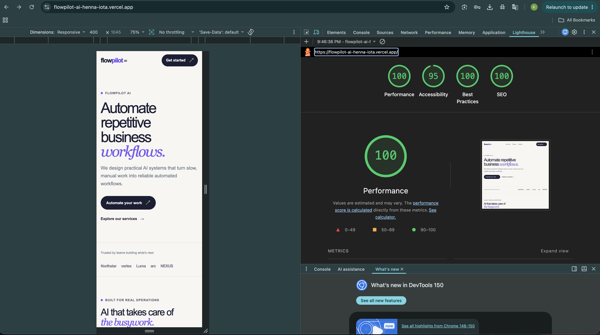
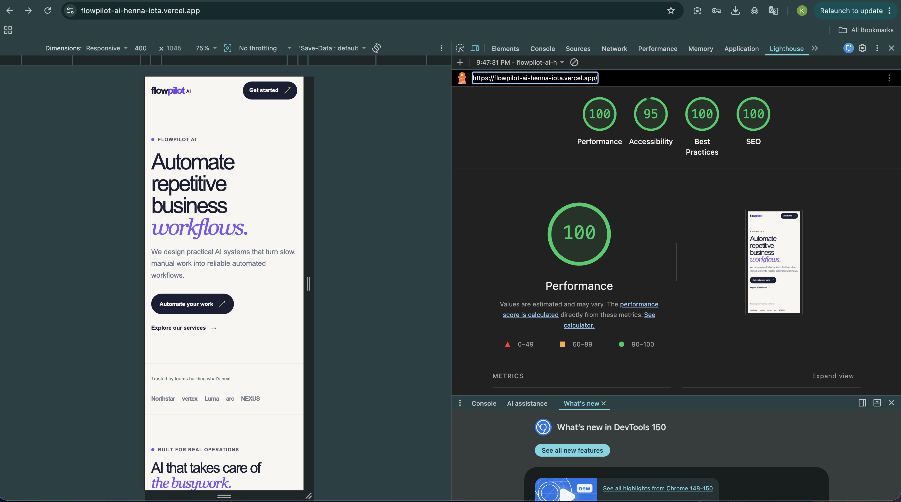

# FlowPilot AI

FlowPilot AI is a polished marketing site for an enterprise workflow-automation platform. It presents AI workflow automation, document processing, intelligent agents, API integrations, and enterprise security through a fast, accessible Next.js experience.

> **Live URL:** Pending Vercel authentication and deployment. See [deployment notes](#deployment) below.

## Features

- Four focused marketing routes: home, product, pricing, and contact
- Reusable layout and UI primitives for consistent buttons, containers, cards, and section titles
- Responsive, keyboard-accessible interface with visible focus states and a skip-to-content link
- Subtle, reduced-motion-friendly transitions and hover interactions
- Page-specific metadata with canonical URLs, Open Graph, Twitter, and robots directives
- JSON-LD structured data for `Organization`, `SoftwareApplication`, `Service`, and `FAQPage`
- Server Component-first architecture with no animation-library dependency

## Tech stack

- [Next.js](https://nextjs.org/) 16 with the App Router
- [React](https://react.dev/) 19 and TypeScript
- Tailwind CSS 4 for the project CSS pipeline
- ESLint for code-quality checks

## Lighthouse

Lighthouse results should be captured against the deployed HTTPS URL, not a local development server. The screenshot directory and capture checklist are ready at [docs/lighthouse](docs/lighthouse/README.md).

Target scores:

| Category | Target |
| --- | ---: |
| Performance | 95–100 |
| Accessibility | 100 |
| Best Practices | 100 |
| SEO | 100 |

After deployment, add desktop and mobile reports as `docs/lighthouse/desktop.png` and `docs/lighthouse/mobile.png`, then embed them here:

```md


```

## Folder structure

```text
src/
├── app/                    # App Router routes, layout, metadata, and global styles
│   ├── page.tsx            # Home page
│   ├── product/page.tsx    # Product page
│   ├── pricing/page.tsx    # Pricing page
│   └── contact/page.tsx    # Contact page
├── components/
│   ├── contact/            # Contact-page sections
│   ├── home/               # Home-page sections
│   ├── layout/             # Navbar and footer
│   ├── pricing/            # Pricing-page sections
│   ├── product/            # Product-page sections
│   ├── seo/                # JSON-LD helper
│   └── ui/                 # Shared Button, Card, Container, and SectionTitle
├── data/                   # Static plan data
└── types/                  # Shared TypeScript types
docs/
└── lighthouse/             # Lighthouse evidence and capture notes
```

## Local setup

### Prerequisites

- Node.js 20 or later
- npm 10 or later

### Run locally

```bash
git clone <your-repository-url>
cd flowpilot-ai
npm install
npm run dev
```

Open [http://localhost:3000](http://localhost:3000).

### Quality checks

```bash
npm run lint
npx tsc --noEmit
npm run build
```

